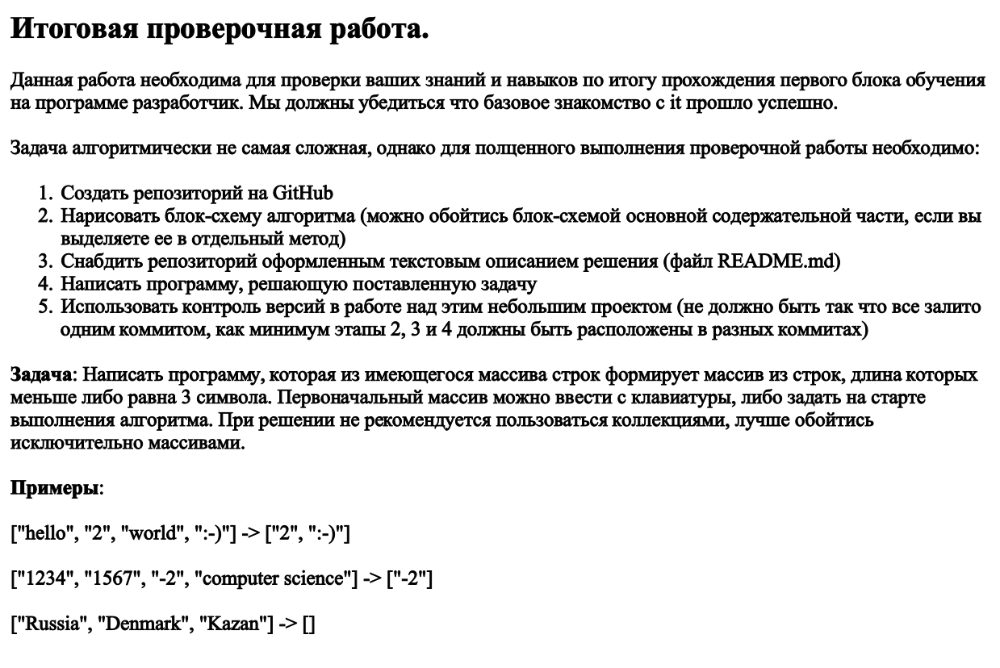

# FINALTASK


## Итоговая проверочная работа.
1. Создать репозиторий на GitHab
2. Нарисовать блок-схему алгоритма (можно обойтись блок-схемой основной содержательной части, если выделяю её в отдельный метод)
3. Снабдить репозиторий оформленным текстовым описанием решения (файл README.md)
4. Написать программу, решающую поставленную задачу
5. Использовать контроль версий в работе над этим проектом (залить разными коммитами как минимум этапы 2,3 и 4)

### Задача:

* Написать программу, которая из имеющегося массива строк,
формирует массив из строк, 
длина которого меньше либо равна 3 символа.
Первоначальный массив можно ввести с клавиатуры,
либо задать на старте выполнения алгоритма.
При решении не рекомендуется пользоваться коллекциями, лучше обойтись исключительно массивами.
```
Примеры:
["hello", "2", "world", ":-)"] -> ["2", ":-)"]
["1234", "1567", "-2", "computer science"] -> ["-2"] 
["Russia", "Denmark", "Kazan"] -> []
```

# Описание решения задачи
1. По условиям задания создаём репозиторий на GitHab
```
https://github.com/RuslanSakaev/FINALTASK.git
```
2. В расширении Draw.io для VSCode рисуем блок-схему
```
stringArray.drawio
```
3.  Обявляем массив строк в трёх вариантах из задания:
```
string[] array = { "hello", "2", "world", ":-)" };
string[] array = { "1234", "1567", "-2", "computer science" };
string[] array = { "Russia", "Denmark", "Kazan" }; 
```
Перед запуском программы, комментируем строки, которые не будем проверять:
```
// string[] array = { "hello", "2", "world", ":-)" };
// string[] array = { "1234", "1567", "-2", "computer science" };
```
Сздаём метод, в котором объявляем массив длинною строк начального массива
и цикл, в котором проверяем меньше либо равен массив трём строкам,
если массив равен 3 стокам, элемент заданного массива заносится в `count` элемента обявенного в методе массива,
если меньше - выводиться пустрая строка.
Переменная `count` переносит из заданного масива в *`урезанный`* значение индекса элемента пока выполняется условие. 
После выполнения метода `ArrayTrimmedStrings` объявляем два массива строк, что бы вывести их с помощью метода `string.Join` в одну строку, как показано в примере к задаче. 

Проверяем работоспособность программы.
Оставляем для проверки строку *"Russia", "Denmark", "Kazan"*, запускаем программу.

Получаем на выходе пустую строку:
~~~
[Russia, Denmark, Kazan] -> []
~~~

Отправляем решение в репозиторий `GitHub`.